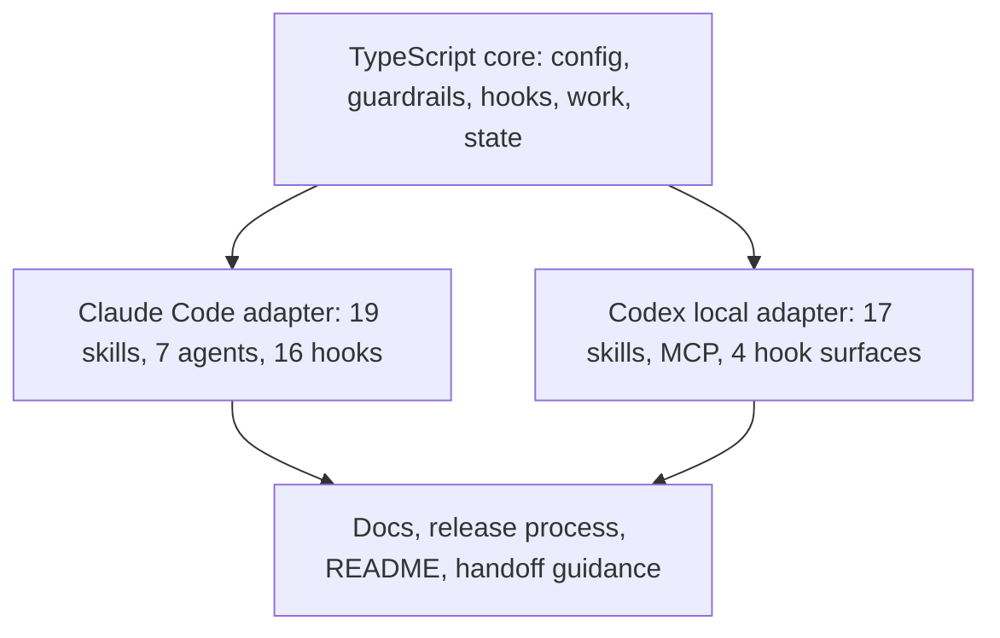

# cc-triad-relay Harness

A portable, TypeScript-powered guardrail and agent harness for Claude Code, with
a Codex local adapter that preserves the same engineering workflow through
Codex skills, hooks, subagents, and CLI review.

## English

### Quality parity verdict

The Harness keeps release-quality parity between the Claude Code adapter and
the Codex local adapter at the workflow-contract level: clarify, plan, branch,
TDD, local review, CodeRabbit, merge, release, and handoff. The adapters are
not intended to expose identical platform metadata.

- Claude Code is the primary public plugin surface. It has commands/skills,
  agents, lifecycle hooks, installer support, `harness doctor`, and the release
  process used by this repository.
- Codex is a local adapter. It exposes the same operator outcomes through
  Codex skills, optional plugin hooks, MCP, project setup templates, subagents,
  isolated worktrees, and `codex exec` second-opinion review.
- The quality bar is the same when both adapters run the same gates: RED,
  GREEN, refactor, pseudo CodeRabbit, PR CodeRabbit, Codex second opinion,
  CI/build, local-only boundary checks, and handoff update.

```mermaid
flowchart LR
  Clarify["clarify"] --> Plan["harness-plan"]
  Plan --> Branch["new-feature-branch"]
  Branch --> TDD["tdd-implement"]
  TDD --> PseudoCR["pseudo-coderabbit-loop"]
  PseudoCR --> FeaturePR["feature PR to dev"]
  FeaturePR --> CodeRabbit["PR CodeRabbit"]
  CodeRabbit --> CodexReview["Codex second opinion"]
  CodexReview --> Dev["merge to dev"]
  Dev --> ReleasePR["release PR dev to main"]
  ReleasePR --> Main["main"]
```



### What this gives you

- **13 guardrail rules** (R01-R13) that block dangerous operations: `sudo`,
  `rm -rf`, force-push, `curl | bash`, `.env` leakage, local-only publication,
  and more. Configure them in `harness.config.json`.
- **5 native agents**: `worker`, `reviewer`, `scaffolder`,
  `security-auditor`, and `context-audit-agent`.
- **2 optional Codex-backed Claude agents**: `codex-sync` and
  `coderabbit-mimic`. They fail fast when the Codex companion is unavailable.
- **19 slash-invoked skills**: 5 verb (`/harness-plan`, `/harness-work`,
  `/harness-review`, `/harness-release`, `/harness-setup`) plus 14 workflow primitives
  (`/clarify`, `/tdd-implement`, `/parallel-worktree`,
  `/parallel-worktree-v2`, `/coderabbit-review`, `/pseudo-coderabbit-loop`,
  `/session-handoff`, `/harness-merge-train`, `/codex-team`,
  `/context-audit`, `/branch-merge`, `/new-feature-branch`,
  `/claude-oneshot`, `/harness-self-improve`).
- **Zero native dependencies** in the runtime state store. The core uses a
  pure JS JSON state store and runs on macOS, Linux, and Windows.



### Claude Code adapter

Install from the public marketplace:

```bash
claude plugin marketplace add ThomasEdwardYorke/cc-triad-relay
claude plugin install harness@cc-triad-relay --scope project
```

Or use a local checkout while developing this repository:

```bash
claude --plugin-dir /path/to/cc-triad-relay/plugins/harness
```

Then initialize from a Claude Code session in the project root:

```text
/harness-setup init
/harness-setup doctor
```

The Claude Code official skills model is skill-first, not command-only. Claude
Code's current docs state that "Custom commands have been merged into skills"
and that existing `.claude/commands/` files keep working. This Harness keeps
its public surface as slash-invoked skills, packaged under `commands/` for
compatibility. Claude plugins can include skills, agents, hooks, MCP servers,
LSP servers, and monitors, and the Harness uses that model together with
worktree isolation and the Agent SDK where those features are appropriate.

Official feature references:

- https://code.claude.com/docs/en/skills
- https://code.claude.com/docs/en/plugins
- https://code.claude.com/docs/en/plugins-reference
- https://code.claude.com/docs/en/worktrees
- https://code.claude.com/docs/en/sub-agents
- https://code.claude.com/docs/en/hooks
- https://code.claude.com/docs/en/mcp
- https://code.claude.com/docs/en/settings
- https://code.claude.com/docs/en/github-actions
- https://code.claude.com/docs/en/agent-sdk/overview

### Codex local adapter

This repository also ships a Codex-native adapter in `plugins/codex-harness/`.
It exposes Harness workflows as Codex skills plus optional Codex plugin hooks,
rather than Claude Code commands or agents.

```bash
# Add this repository as a local marketplace:
codex plugin marketplace add /path/to/cc-triad-relay

# In a consuming project's own local marketplace flow:
codex plugin marketplace add /path/to/project
```

After adding the marketplace, enable `codex-harness` from the project
marketplace. Current Codex skills are `branch-merge`, `clarify`,
`coderabbit-review`, `codex-team`, `context-audit`, `harness-merge-train`,
`harness-plan`, `harness-release`, `harness-review`,
`harness-self-improve`, `harness-setup`, `harness-work`,
`new-feature-branch`, `parallel-worktree`, `pseudo-coderabbit-loop`,
`session-handoff`, and `tdd-implement`.

Codex plugin hooks are opt-in:

```toml
[features]
hooks = true
plugin_hooks = true
multi_agent = true
```

After enabling the flags and the plugin, restart Codex and run `/hooks` to
review and trust the plugin hooks. The bundled hooks cover destructive tool
guardrails, permission requests, prompt secret checks, and stop-time completion
reminders.

`harness-setup` can guide a concise `AGENTS.md` and project-scoped
`.codex/config.toml` from bundled templates. Keep provider, auth, telemetry,
personal machine paths, active branch notes, PR state, and handoff session
state out of shared project config.

### New project installation

Use Handoff-mode for new projects unless there is a reason to stay on a single
`Plans.md` file.

Claude Code:

```bash
cd /path/to/new-project
claude plugin marketplace add ThomasEdwardYorke/cc-triad-relay
claude plugin install harness@cc-triad-relay --scope project
```

Inside Claude Code:

```text
/harness-setup init
/harness-setup doctor
/session-handoff init
```

Codex:

```bash
cd /path/to/new-project
# Add this repository as the Harness marketplace:
codex plugin marketplace add /path/to/cc-triad-relay

# If the project itself owns the local marketplace metadata:
codex plugin marketplace add /path/to/project
```

Then enable `codex-harness`, run `harness-setup`, and review the generated or
suggested `AGENTS.md` and `.codex/config.toml`.

### Existing project installation

For an active project, keep the first change small:

1. Verify the checkout and branch with `git status --short --branch`.
2. Install the adapter for the tool the project actually uses first.
3. Run `harness doctor` or `harness-setup`.
4. Keep existing `Plans.md` workflows intact if the project already depends on
   them.
5. Move to Handoff-mode in a separate change only after the team agrees on the
   four-file layout: `current`, `backlog`, `roadmap`, and `decisions`.
6. Keep local state local. Before publishing, verify
   `git ls-files -- harness.config.json docs/maintainer/handoff .docs/handoff`.

### Release readiness

Feature work lands on `dev` through PRs. Release exposure goes through a
separate `dev` to `main` release PR. Do not push directly to `main`.

Required local checks before a release PR is treated as ready:

```bash
npm test --workspace=plugins/harness/core
npm run build
git diff --check
git ls-files -- harness.config.json docs/maintainer/handoff .docs/handoff
coderabbit review --agent --base dev --type committed
```

PR checks must include CI/build status, CodeRabbit clear state, and scoped
responses to every actionable review finding. On `dev` PRs, trigger PR
CodeRabbit manually when auto-review is not configured for that base:

```bash
gh pr comment <pr-number> --body "@coderabbitai review"
```

### Optional companion: `openai-codex`

The Harness ships stack- and LLM-neutral. Two Claude agents, `codex-sync` and
`coderabbit-mimic`, shell out to the OpenAI Codex companion plugin to run
synchronous code review and pseudo-CodeRabbit flows. Without Codex installed,
invoking either agent errors immediately with a clear message. Every other
agent, skill, guardrail, and hook works without Codex.

| Plugin installed | What works | What errors on invocation |
|---|---|---|
| `harness` only | All 13 guardrails, 19 slash-invoked skills (5 verb + 14 workflow), 5 native agents, all 16 lifecycle hooks | `codex-sync` and `coderabbit-mimic` fail fast before work starts. |
| `harness` + `codex` | Everything above plus Codex-powered synchronous review and local pseudo-CodeRabbit | Nothing adapter-specific. |

### Task tracker modes

Plans-mode is the backward-compatible single-file flow:

```json
{
  "work": {
    "taskTrackerMode": "plans",
    "plansFile": "Plans.md"
  }
}
```

Handoff-mode is recommended for new projects:

```json
{
  "work": {
    "taskTrackerMode": "handoff",
    "handoffPaths": {
      "roadmap": ".docs/handoff/<project>-roadmap.md",
      "backlog": ".docs/handoff/<project>-backlog.md",
      "current": ".docs/handoff/<project>-current.md",
      "decisions": ".docs/handoff/<project>-decisions.md"
    }
  }
}
```

Template default and in-memory default intentionally differ. New projects
bootstrapped through templates start in Handoff-mode. The in-memory
`DEFAULT_CONFIG` remains Plans-mode to avoid breaking existing consumers that
do not define `handoffPaths`.

### Documentation

- [Installation](./docs/en/installation.md)
- [Architecture](./docs/en/architecture.md)
- [Configuration](./docs/en/configuration.md)
- [Guardrails](./docs/en/guardrails.md)
- [Agents](./docs/en/agents.md)
- [Commands](./docs/en/commands.md)
- [Development](./docs/en/development.md)
- [Migration](./docs/en/migration-from-v2.md)
- [Security](./docs/en/security.md)
- [Troubleshooting](./docs/en/troubleshooting.md)
- [Release process](./docs/maintainer/release-process.md)

Japanese docs: [docs/ja/](./docs/ja/)

## 日本語

### 品質同等性の判定

Claude Code 側と Codex 側は、同じ品質ゲートを通すという意味で同等です。両者は同じ
metadata 構造ではありません。Claude Code 側は公開 plugin surface が広く、Codex
側は local adapter として skills、optional hooks、MCP、subagents、isolated
worktrees、`codex exec` review で同じ成果を再現します。

同じ品質として扱う条件は次の通りです。

- clarify で要件を詰める。
- harness-plan で task と acceptance criteria を固定する。
- feature branch を切る。
- RED、GREEN、refactor の TDD を通す。
- pseudo CodeRabbit と CodeRabbit CLI を使う。
- PR CodeRabbit の actionable finding をすべて処理する。
- Codex second opinion を通す。
- CI/build と local-only boundary を確認する。
- merge 後に handoff を更新する。

### Claude Code adapter

Claude Code 側は primary adapter です。19 slash-invoked skills、7 agents、16
lifecycle hooks、TypeScript core、installer、doctor、release process を持ちます。

```bash
claude plugin marketplace add ThomasEdwardYorke/cc-triad-relay
claude plugin install harness@cc-triad-relay --scope project
```

### Codex local adapter

Codex 側は local adapter です。17 skills、4 hook surfaces、MCP、AGENTS/config
templates、Codex second-opinion contract を持ちます。Claude 固有の primitive は、
Codex の subagents、CLI、isolated worktrees に置き換えます。

```bash
codex plugin marketplace add /path/to/cc-triad-relay
```

有効化後は必要に応じて次を設定します。

```toml
[features]
hooks = true
plugin_hooks = true
multi_agent = true
```

### 新規プロジェクトへの導入

新規 project は Handoff-mode を推奨します。Claude Code では marketplace から
install し、`/harness-setup init`、`/harness-setup doctor`、
`/session-handoff init` を実行します。

Codex では local checkout を marketplace として追加し、`codex-harness` を有効化
します。`harness-setup` で `AGENTS.md` と `.codex/config.toml` を確認し、個人
path、credential、branch memo、PR state は shared config に入れません。

### 進行中プロジェクトへの導入

進行中 project では既存運用を壊さないことを優先します。

1. `git status --short --branch` で checkout を確認する。
2. まず実際に使っている adapter だけを入れる。
3. `harness doctor` または `harness-setup` で設定を確認する。
4. 既存 `Plans.md` がある場合は維持してよい。
5. Handoff-mode 移行は別 PR に分ける。
6. 公開前に `git ls-files -- harness.config.json docs/maintainer/handoff .docs/handoff`
   が空であることを確認する。

### リリース準備

feature work は `dev` へ PR で入れます。その後、`dev` から `main` への release PR
を作ります。`main` へ直接 push しません。

```bash
npm test --workspace=plugins/harness/core
npm run build
git diff --check
git ls-files -- harness.config.json docs/maintainer/handoff .docs/handoff
coderabbit review --agent --base dev --type committed
```

`dev` base の PR で CodeRabbit auto-review が動かない場合は、手動で
`@coderabbitai review` をコメントします。CodeRabbit CLI は push 前の local review
にも使い、PR CodeRabbit は merge 前の正式 review として扱います。

### 既知の注意点

- Codex hooks は opt-in です。Claude Code の 16 lifecycle events と同じ発火面では
  ありません。
- Codex adapter は local marketplace checkout 前提です。Claude Code marketplace
  install と同じ配布成熟度ではありません。
- `.docs/` は local-only 資料の置き場です。公開 README には評価結果の要約と導入手順
  だけを残します。
- `.docs/handoff`、`harness.config.json`、`docs/maintainer/handoff` を tracked
  file にしないでください。

## License

MIT. See [LICENSE](./LICENSE) and [NOTICE](./NOTICE).

## Maintainer Notes

If you fork this repository, run `scripts/set-owner.sh <your-github-user>` to
rewrite owner references before publishing to your own marketplace. Maintainer
documentation lives in `docs/maintainer/` and is excluded from marketplace
distribution.
